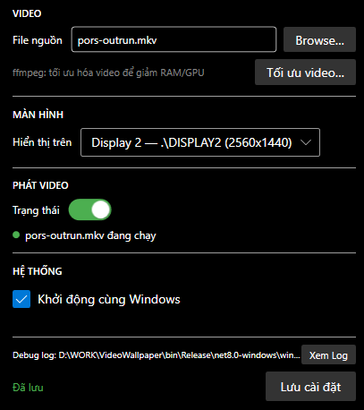

# Video Wallpaper

**Đặt video làm hình nền động trên Windows** — video phát liên tục phía sau icon desktop và tất cả cửa sổ, đúng như wallpaper tĩnh mặc định của Windows. Chạy nền ở system tray, không chiếm taskbar, không gây phiền nhiễu.

Sử dụng kỹ thuật **WorkerW injection** qua Win32 API để nhúng cửa sổ WPF vào đúng layer desktop của `explorer.exe` — không dùng hook hay driver, chỉ là Windows API thuần.

---

## Screenshots



> *Cửa sổ Settings: chọn video, màn hình, bật/tắt phát và tối ưu hóa file*

---

## Tính năng

- Phát video MP4, AVI, MOV làm hình nền (MKV cần cài codec)
- Video nằm đúng **WorkerW layer** — phía sau icons, phía trên wallpaper tĩnh
- Hỗ trợ nhiều màn hình — chọn monitor hiển thị
- Loop mượt không flash (MediaTimeline + RepeatBehavior.Forever)
- System tray utility — không chiếm taskbar, đóng cửa sổ chỉ ẩn UI
- **Singleton với IPC** — mở app lần 2 khi đang chạy sẽ focus lại cửa sổ Settings (không hiện thông báo)
- Khởi động cùng Windows (`--minimized`, ghi registry)
- **Tự phục hồi** khi `explorer.exe` restart (hook `TaskbarCreated`)
- **Tối ưu video bằng ffmpeg** — tích hợp sẵn trong UI, giảm kích thước file và chuẩn hóa codec
- DPI-aware PerMonitorV2 — đúng trên màn HiDPI/4K/multi-DPI
- Version tự tăng mỗi lần build (hiển thị trên title bar)

---

## Yêu cầu hệ thống

- Windows 10 / 11
- [.NET 8 Desktop Runtime](https://dotnet.microsoft.com/download/dotnet/8.0) (hoặc dùng bản self-contained)
- ffmpeg trong PATH (tùy chọn, chỉ cần nếu dùng tính năng tối ưu video)

---

## Build & chạy

```bash
dotnet build
dotnet run

# Publish bản portable (không cần cài .NET)
dotnet publish -c Release -r win-x64 --self-contained
```

VS Code / Cursor: `Ctrl+Shift+B` chạy `dotnet run` trực tiếp.

---

## Video mẫu

Thư mục [`samples/`](samples/) chứa 2 video mẫu để thử ngay:

| File | Kích thước | Mô tả |
| --- | --- | --- |
| `s1.mp4` | 1.6 MB | Video mẫu 1 |
| `s2.mp4` | 3.6 MB | Video mẫu 2 |

---

## Sử dụng

1. Chạy ứng dụng — cửa sổ Settings hiện ra
2. **Browse…** → chọn file video trong `samples/` để thử ngay, hoặc chọn file của bạn
3. Chọn màn hình hiển thị (nếu có nhiều monitor)
4. Bật **toggle** để phát video làm wallpaper
5. **Lưu cài đặt** để lưu cấu hình
6. Đóng cửa sổ → app tiếp tục chạy ở system tray

### Tối ưu video

Nhấn **"Tối ưu video…"** để chạy ffmpeg tự động:

- Encode H.264, giới hạn 1080p, bỏ audio track, bật faststart
- Hiện kích thước trước/sau, hỏi có dùng file mới ngay không
- Cần `ffmpeg` có trong PATH

### Tray icon

| Thao tác | Kết quả |
| --- | --- |
| Click trái | Mở lại cửa sổ Settings |
| Click phải | Menu: Mở cài đặt / Thoát |
| Mở app lần 2 | Tự động focus cửa sổ Settings đang chạy |

### Khởi động cùng Windows

Bật checkbox **"Khởi động cùng Windows"** → ghi registry `HKCU\...\Run` với arg `--minimized` → app tự chạy khi boot, phát video ngay, không hiện UI.

---

## Cách hoạt động (tóm tắt kỹ thuật)

App tạo `WallpaperWindow` (WPF, fullscreen, không border) chứa `MediaElement`, sau đó dùng Win32 API để gắn vào **WorkerW layer** của Windows Explorer:

```text
SendMessageTimeout(Progman, 0x052C)   ← tạo WorkerW
→ EnumWindows tìm WorkerW sau SHELLDLL_DefView
→ SetParent(WallpaperHwnd, WorkerW)   ← gắn vào đúng layer
→ SetWindowPos(physical pixels)        ← định vị theo monitor
```

Khi `explorer.exe` restart, app nhận broadcast `TaskbarCreated` và tự re-attach.

---

## Cấu hình

| File | Đường dẫn |
| --- | --- |
| Config | `%AppData%\VideoWallpaper\config.json` |
| Debug log | `%LocalAppData%\VideoWallpaper\debug.log` |

```json
{
  "videoPath": "C:\\Users\\user\\Videos\\wallpaper.mp4",
  "monitorDevice": "\\\\.\\DISPLAY1",
  "isPlaying": true,
  "autostart": true
}
```

---

## Format video được hỗ trợ

| Format | Codec | Hỗ trợ |
| --- | --- | --- |
| MP4 | H.264 (AVC) | Tốt nhất, Windows tích hợp sẵn |
| MP4 | H.265 (HEVC) | Cần HEVC Video Extensions (Microsoft Store) |
| AVI | H.264 | OK |
| MKV | H.264 | Thường OK, phụ thuộc codec |
| MKV | H.265/VP9/AV1 | Cần K-Lite Codec Pack |

**Khuyến nghị:** MP4 H.264, encode bằng lệnh:

```bash
ffmpeg -i input.mkv -c:v libx264 -preset slow -crf 23 -vf scale='min(iw,1920)':'min(ih,1080)' -an -movflags +faststart output.mp4
```

---

## Stack công nghệ

| Thành phần | Lựa chọn | Ghi chú |
| --- | --- | --- |
| Ngôn ngữ | C# 12 (.NET 8) | |
| UI Framework | WPF | XAML, code-behind |
| UI Theme | ModernWpfUI 0.9.6 | Dark mode, Fluent style |
| Video | WPF MediaElement | WMF/DirectShow, DXVA2 hardware decode |
| Video loop | MediaTimeline + Storyboard | RepeatBehavior.Forever — không flash |
| Config | System.Text.Json | %AppData%\VideoWallpaper\config.json |
| Monitor | System.Windows.Forms.Screen | Physical pixel bounds |
| Autostart | Microsoft.Win32.Registry | HKCU Run key |
| Tray | System.Windows.Forms.NotifyIcon | |
| IPC | Win32 RegisterWindowMessage + PostMessage broadcast | Singleton focus |
| DPI | PerMonitorV2 | app.manifest + csproj |
| Win32 P/Invoke | user32.dll | SetParent, SetWindowPos, EnumWindows, SendMessageTimeout, FindWindow/Ex, RegisterWindowMessage |
| Video optimization | ffmpeg (external) | Async process, progress UI |
| Versioning | AssemblyVersion 1.0.* | Auto-increment build per day |

---

## License

MIT
